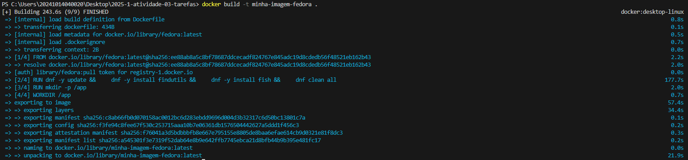
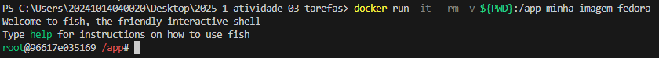
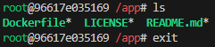
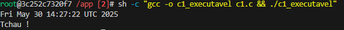
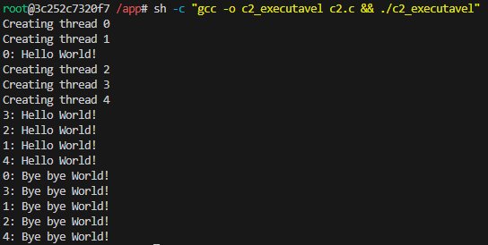
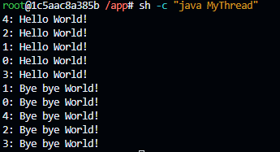
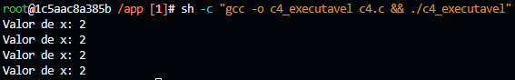
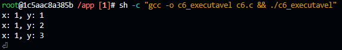
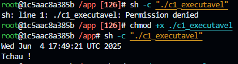

# Ryan Ferreira Paulista - 04/06/2025

## Objetivo

Esta atividade tem como objetivo ensinar o aluno a criar, configurar, e utilizar ambientes isolados em Docker para compilar e executar programas em C.

## Passos excutados

### 1.1 Criação da imagem docker

### 1.2 Execução do container docker

### 1.3 Verificação de funcionamento 

Foram executados alguns códigos em C e Java, o resultados estarão na seção resultados obtidos.

## Resultados obtidos

Resultados após compilação e execução dos códigos:

Em alguns arquivos foi necessário usar o comando chmod para excutar os arquivos

